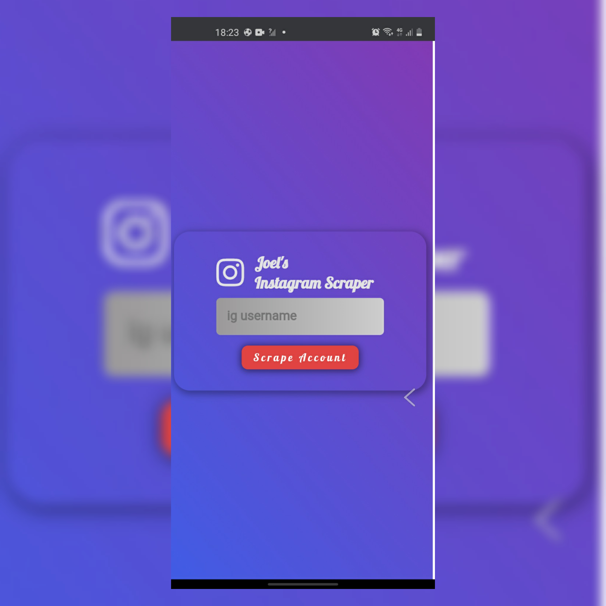

## Instagram Scraper

To run the web app, 
Make sure you have Node insatlled

1. You have to clone this repository into your computer by typing the below command in your command line.

       git clone https://github.com/Ndohjapan/ig-scraper.git
       
2. From your command line cd into the `ig-scraper` directory and type the following

       npm install
       
   This will install every necessary node module 
         1. Express for running the server
         2. Cherrio for the scraping
         3. request and request-promise for making request to the url
        

3. From the coommand line, run the server 
              
       node app
       
4. Open your browser to localhost with the port number 1898
        
        
5. Insert the instagram username and watch it bring out the data of the account
        
